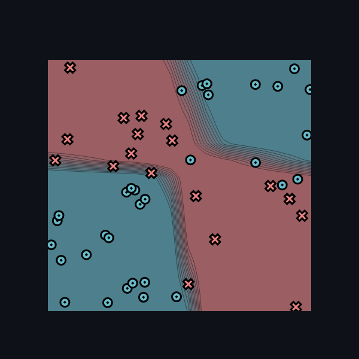

[](https://classroom.github.com/a/YFgwt0yY)
# MiniTorch Module 2


* Docs: https://minitorch.github.io/

* Overview: https://minitorch.github.io/module2/module2/

This assignment requires the following files from the previous assignments. You can get these by running

```bash
python sync_previous_module.py previous-module-dir current-module-dir
```

The files that will be synced are:

        minitorch/operators.py minitorch/module.py minitorch/autodiff.py minitorch/scalar.py minitorch/scalar_functions.py minitorch/module.py project/run_manual.py project/run_scalar.py project/datasets.py

* Task 2.5

* Simple Dataset

Hidden layer: 8

Learning Rate: 0.1

Number of epochs: 600


Ouput training logs:
Epoch 600/600. Time per epoch: 0.605s. Time left: 0.00s.
Epoch: 10/600, loss: 34.42105359386035, correct: 28
Epoch: 20/600, loss: 32.46211963189382, correct: 30
Epoch: 30/600, loss: 30.87196221456897, correct: 34
Epoch: 40/600, loss: 29.47970524768956, correct: 38
Epoch: 50/600, loss: 28.033145026906176, correct: 42
Epoch: 60/600, loss: 26.486135037464024, correct: 42
Epoch: 70/600, loss: 24.84671163644115, correct: 48
Epoch: 80/600, loss: 23.227079861269555, correct: 47
Epoch: 90/600, loss: 21.660923760374427, correct: 47
Epoch: 100/600, loss: 20.166545298775763, correct: 47
Epoch: 110/600, loss: 18.692684821558114, correct: 47
Epoch: 120/600, loss: 17.23705108557306, correct: 47
Epoch: 130/600, loss: 15.824118379756884, correct: 47
Epoch: 140/600, loss: 14.467506883284932, correct: 48
Epoch: 150/600, loss: 13.182279594877045, correct: 47
Epoch: 160/600, loss: 12.034033434843142, correct: 48
Epoch: 170/600, loss: 11.015675689722338, correct: 48
Epoch: 180/600, loss: 10.149832117625012, correct: 48
Epoch: 190/600, loss: 9.395179993372885, correct: 48
Epoch: 200/600, loss: 8.73861361770757, correct: 49
Epoch: 210/600, loss: 8.167534012866536, correct: 49
Epoch: 220/600, loss: 7.673963707713692, correct: 49
Epoch: 230/600, loss: 7.255245011603115, correct: 49
Epoch: 240/600, loss: 6.885720511878558, correct: 49
Epoch: 250/600, loss: 6.5577411652563695, correct: 49
Epoch: 260/600, loss: 6.266955002864253, correct: 49
Epoch: 270/600, loss: 6.008155509474793, correct: 49
Epoch: 280/600, loss: 5.7746308056216, correct: 49
Epoch: 290/600, loss: 5.56273284938858, correct: 49
Epoch: 300/600, loss: 5.369987741006599, correct: 49
Epoch: 310/600, loss: 5.194212917722268, correct: 49
Epoch: 320/600, loss: 5.033934636981529, correct: 49
Epoch: 330/600, loss: 4.886420523694934, correct: 49
Epoch: 340/600, loss: 4.749973683171653, correct: 49
Epoch: 350/600, loss: 4.623466857788244, correct: 49
Epoch: 360/600, loss: 4.505479569233787, correct: 49
Epoch: 370/600, loss: 4.395011824696578, correct: 49
Epoch: 380/600, loss: 4.291305513154346, correct: 49
Epoch: 390/600, loss: 4.1938688807051765, correct: 49
Epoch: 400/600, loss: 4.1021765525022245, correct: 49
Epoch: 410/600, loss: 4.015456511979696, correct: 49
Epoch: 420/600, loss: 3.9333760530816706, correct: 49
Epoch: 430/600, loss: 3.855406314208116, correct: 50
Epoch: 440/600, loss: 3.781198632663819, correct: 50
Epoch: 450/600, loss: 3.7104390945668797, correct: 50
Epoch: 460/600, loss: 3.6429847522884096, correct: 50
Epoch: 470/600, loss: 3.5788392569958063, correct: 50
Epoch: 480/600, loss: 3.5173214001686643, correct: 50
Epoch: 490/600, loss: 3.4582413743297558, correct: 50
Epoch: 500/600, loss: 3.401430483375043, correct: 50
Epoch: 510/600, loss: 3.346739911052817, correct: 50
Epoch: 520/600, loss: 3.294032839819184, correct: 50
Epoch: 530/600, loss: 3.2431809953986597, correct: 50
Epoch: 540/600, loss: 3.194070916693793, correct: 50
Epoch: 550/600, loss: 3.1465988193343803, correct: 50
Epoch: 560/600, loss: 3.1007017884358885, correct: 50
Epoch: 570/600, loss: 3.056251770652255, correct: 50
Epoch: 580/600, loss: 3.013169911800591, correct: 50
Epoch: 590/600, loss: 2.9719671119316975, correct: 50
Epoch: 600/600, loss: 2.931931108690386, correct: 50


* Diag Dataset

Hidden layer: 8

Learning Rate: 0.5

Number of epochs: 200


Ouput training logs:
Epoch 200/200. Time per epoch: 0.599s. Time left: 0.00s.
Epoch: 10/200, loss: 18.69341388229465, correct: 42
Epoch: 20/200, loss: 16.36291125775881, correct: 42
Epoch: 30/200, loss: 13.74582306283045, correct: 42
Epoch: 40/200, loss: 11.172907196428024, correct: 42
Epoch: 50/200, loss: 8.718947859337842, correct: 45
Epoch: 60/200, loss: 6.783723253900132, correct: 49
Epoch: 70/200, loss: 5.539124535218867, correct: 49
Epoch: 80/200, loss: 4.620145982674597, correct: 49
Epoch: 90/200, loss: 3.925437568425817, correct: 50
Epoch: 100/200, loss: 3.381809506955374, correct: 50
Epoch: 110/200, loss: 2.951614105743656, correct: 50
Epoch: 120/200, loss: 2.608178070575429, correct: 50
Epoch: 130/200, loss: 2.3330567472839467, correct: 50
Epoch: 140/200, loss: 2.340077717431271, correct: 49
Epoch: 150/200, loss: 11.887011569596625, correct: 43
Epoch: 160/200, loss: 2.08930995576708, correct: 49
Epoch: 170/200, loss: 1.7917278522634186, correct: 50
Epoch: 180/200, loss: 1.625472685758267, correct: 50
Epoch: 190/200, loss: 1.4910412776071529, correct: 50
Epoch: 200/200, loss: 1.379292023498579, correct: 50


* Split Dataset

Hidden layer: 8

Learning Rate: 1.0

Number of epochs: 400


Ouput training logs:
Epoch 400/400. Time per epoch: 0.603s. Time left: 0.00s.
Epoch: 10/400, loss: 33.22101244562673, correct: 32
Epoch: 20/400, loss: 32.440782624209476, correct: 40
Epoch: 30/400, loss: 30.687640165855356, correct: 39
Epoch: 40/400, loss: 33.02914132032586, correct: 30
Epoch: 50/400, loss: 27.671254109186947, correct: 39
Epoch: 60/400, loss: 22.521056922834617, correct: 41
Epoch: 70/400, loss: 18.93621690971245, correct: 42
Epoch: 80/400, loss: 32.216937035740905, correct: 29
Epoch: 90/400, loss: 20.481103644293835, correct: 35
Epoch: 100/400, loss: 24.519840396220346, correct: 38
Epoch: 110/400, loss: 21.414196196333727, correct: 38
Epoch: 120/400, loss: 16.697831127319883, correct: 43
Epoch: 130/400, loss: 25.463550824307124, correct: 41
Epoch: 140/400, loss: 23.542964543674845, correct: 36
Epoch: 150/400, loss: 22.65886849036124, correct: 36
Epoch: 160/400, loss: 24.238131338150424, correct: 40
Epoch: 170/400, loss: 34.777212910365, correct: 40
Epoch: 180/400, loss: 10.238518409000722, correct: 50
Epoch: 190/400, loss: 12.07398172395518, correct: 50
Epoch: 200/400, loss: 12.453379886886388, correct: 50
Epoch: 210/400, loss: 22.886555352195995, correct: 42
Epoch: 220/400, loss: 52.25715956214484, correct: 29
Epoch: 230/400, loss: 9.842949110934189, correct: 47
Epoch: 240/400, loss: 14.430870534240935, correct: 45
Epoch: 250/400, loss: 3.982166137623707, correct: 49
Epoch: 260/400, loss: 31.290251822525317, correct: 38
Epoch: 270/400, loss: 7.069528161191508, correct: 47
Epoch: 280/400, loss: 3.594307295525847, correct: 50
Epoch: 290/400, loss: 2.2593764956998563, correct: 50
Epoch: 300/400, loss: 26.650128480310443, correct: 40
Epoch: 310/400, loss: 9.880625144957717, correct: 47
Epoch: 320/400, loss: 2.347763949390929, correct: 50
Epoch: 330/400, loss: 37.50159726696655, correct: 40
Epoch: 340/400, loss: 2.7748345689668836, correct: 50
Epoch: 350/400, loss: 5.0695151848977495, correct: 49
Epoch: 360/400, loss: 1.2960146161144843, correct: 50
Epoch: 370/400, loss: 0.9775457588176013, correct: 50
Epoch: 380/400, loss: 0.8084077135874888, correct: 50
Epoch: 390/400, loss: 0.6938402730332984, correct: 50
Epoch: 400/400, loss: 0.6096213623859231, correct: 50


* Xor Dataset

Hidden layer: 8

Learning Rate: 0.5

Number of epochs: 600




Ouput training logs:
Epoch 600/600. Time per epoch: 0.609s. Time left: 0.00s.
Epoch: 10/750, loss: 31.59085720352632, correct: 33
Epoch: 20/750, loss: 31.055619789819385, correct: 33
Epoch: 30/750, loss: 30.370803923923614, correct: 33
Epoch: 40/750, loss: 29.47261135378215, correct: 34
Epoch: 50/750, loss: 28.407075108561074, correct: 35
Epoch: 60/750, loss: 27.135726085516268, correct: 33
Epoch: 70/750, loss: 25.914055220564112, correct: 34
Epoch: 80/750, loss: 24.86848342752998, correct: 34
Epoch: 90/750, loss: 25.00824197189917, correct: 35
Epoch: 100/750, loss: 24.996422735652068, correct: 35
Epoch: 110/750, loss: 27.892110406731565, correct: 33
Epoch: 120/750, loss: 25.8575132273046, correct: 33
Epoch: 130/750, loss: 25.20983741665844, correct: 33
Epoch: 140/750, loss: 24.046843523837843, correct: 35
Epoch: 150/750, loss: 24.11298009565289, correct: 35
Epoch: 160/750, loss: 23.866762153744215, correct: 35
Epoch: 170/750, loss: 23.191945620761732, correct: 35
Epoch: 180/750, loss: 23.750232624521235, correct: 35
Epoch: 190/750, loss: 23.14820128669678, correct: 35
Epoch: 200/750, loss: 23.757970501578587, correct: 34
Epoch: 210/750, loss: 22.688868005345405, correct: 35
Epoch: 220/750, loss: 20.02068967540035, correct: 39
Epoch: 230/750, loss: 20.880887855401802, correct: 38
Epoch: 240/750, loss: 20.67083163402244, correct: 38
Epoch: 250/750, loss: 19.757886109156917, correct: 39
Epoch: 260/750, loss: 22.74833213557228, correct: 37
Epoch: 270/750, loss: 20.128947028174167, correct: 38
Epoch: 280/750, loss: 16.3961131420474, correct: 41
Epoch: 290/750, loss: 18.01126531193805, correct: 40
Epoch: 300/750, loss: 18.999056495311248, correct: 39
Epoch: 310/750, loss: 17.211870834136352, correct: 41
Epoch: 320/750, loss: 17.355562537561376, correct: 41
Epoch: 330/750, loss: 18.009901972987794, correct: 40
Epoch: 340/750, loss: 15.866220060943963, correct: 43
Epoch: 350/750, loss: 18.616089213278617, correct: 40
Epoch: 360/750, loss: 19.27551568120382, correct: 40
Epoch: 370/750, loss: 14.758239911076549, correct: 43
Epoch: 380/750, loss: 18.529737885984673, correct: 39
Epoch: 390/750, loss: 15.37378674253124, correct: 41
Epoch: 400/750, loss: 18.36528867342193, correct: 40
Epoch: 410/750, loss: 14.165087865884809, correct: 42
Epoch: 420/750, loss: 18.994995674100437, correct: 39
Epoch: 430/750, loss: 13.613939853266631, correct: 43
Epoch: 440/750, loss: 16.261099809101676, correct: 41
Epoch: 450/750, loss: 14.98586115061193, correct: 42
Epoch: 460/750, loss: 13.896415897468838, correct: 43
Epoch: 470/750, loss: 14.28070197417583, correct: 43
Epoch: 480/750, loss: 13.57715293793239, correct: 43
Epoch: 490/750, loss: 13.91502546038575, correct: 43
Epoch: 500/750, loss: 12.949921422617669, correct: 44
Epoch: 510/750, loss: 12.810103244632364, correct: 44
Epoch: 520/750, loss: 10.50860553898804, correct: 44
Epoch: 530/750, loss: 12.171323886092399, correct: 44
Epoch: 540/750, loss: 11.639676538830917, correct: 44
Epoch: 550/750, loss: 9.333722796235188, correct: 44
Epoch: 560/750, loss: 15.522805848452363, correct: 41
Epoch: 570/750, loss: 9.063594341726365, correct: 44
Epoch: 580/750, loss: 9.967810619366725, correct: 44
Epoch: 590/750, loss: 10.593917975395405, correct: 44
Epoch: 600/750, loss: 10.557098161338036, correct: 44
Epoch: 610/750, loss: 10.03026308071666, correct: 44
Epoch: 620/750, loss: 9.800610456353647, correct: 44
Epoch: 630/750, loss: 9.546964473502639, correct: 45
Epoch: 640/750, loss: 9.084435271399595, correct: 45
Epoch: 650/750, loss: 8.722314982688987, correct: 45
Epoch: 660/750, loss: 8.48388774189351, correct: 45
Epoch: 670/750, loss: 7.53232192112454, correct: 46
Epoch: 680/750, loss: 7.902064615017276, correct: 45
Epoch: 690/750, loss: 6.814726623522559, correct: 46
Epoch: 700/750, loss: 7.030777002822237, correct: 45
Epoch: 710/750, loss: 6.891250959713645, correct: 46
Epoch: 720/750, loss: 6.428308874065893, correct: 46
Epoch: 730/750, loss: 6.2759231710574666, correct: 46
Epoch: 740/750, loss: 6.4403789451308535, correct: 46
Epoch: 750/750, loss: 6.211065192569054, correct: 46